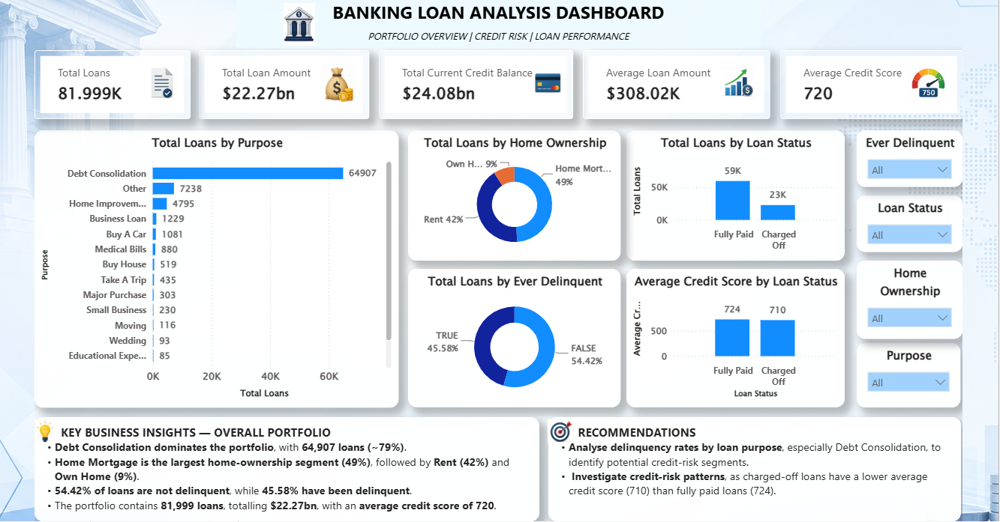
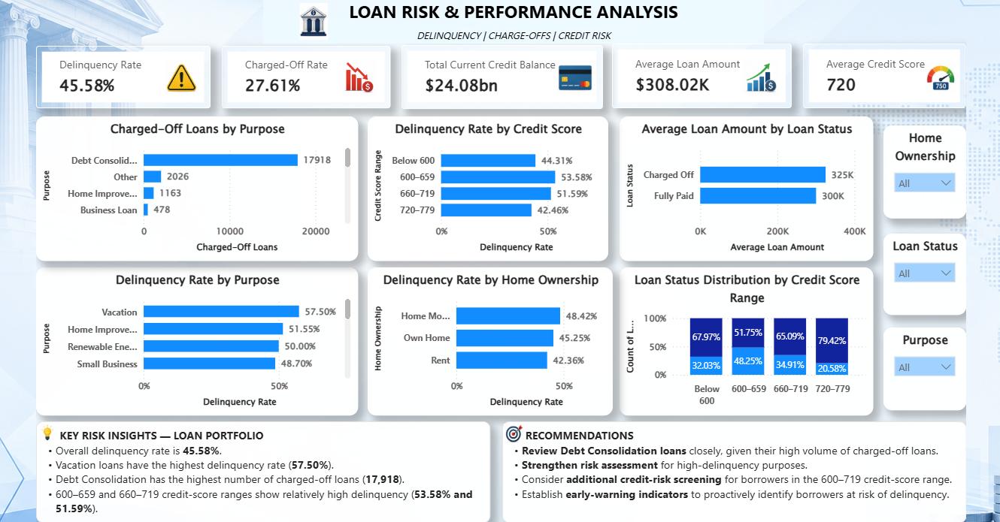

# Banking Loan Risk Analysis – Power BI

A Power BI dashboard for analyzing loan portfolio performance, delinquency, charge-offs, credit risk, and borrower characteristics.

## 📊 Dashboard Preview

### Executive / Portfolio View



### Loan Risk & Performance Analysis



---

## 🎯 Project Objective

The objective of this project is to analyze a banking loan portfolio and identify key patterns related to:

- Loan portfolio distribution
- Delinquency
- Charged-off loans
- Credit risk
- Credit score segments
- Home ownership
- Loan purposes
- Loan performance

The dashboard helps identify high-risk segments and provides insights that can support better credit-risk monitoring and decision-making.

---

## 🛠️ Tools & Technologies

- Power BI
- DAX
- Power Query
- Data Modeling
- Data Visualization

---

## 🗂️ Data Model

The project uses a star-schema-based data model consisting of:

- `Fact_Loans` – Loan-level transactional data
- `Dim_Customers` – Customer information
- `Dim_Purpose` – Loan purpose information

### Key Relationships

- `Dim_Customers` → `Fact_Loans`
- `Dim_Purpose` → `Fact_Loans`

---

## 📌 Key KPIs

| KPI | Value |
|---|---:|
| Total Loans | 81,999 |
| Total Loan Amount | $22.27bn |
| Current Credit Balance | $24.08bn |
| Average Loan Amount | $308.02K |
| Average Credit Score | 720 |
| Delinquency Rate | 45.58% |
| Charged-Off Rate | 27.61% |

---

## 🔍 Key Insights

- Debt Consolidation is the largest loan-purpose segment with **64,907 loans**.
- Home Mortgage represents the largest home-ownership segment at approximately **49%**.
- **45.58%** of loans are associated with delinquency.
- Vacation loans have the highest observed delinquency rate at **57.50%**.
- Debt Consolidation has the highest number of charged-off loans at **17,918**.
- Borrowers in the **600–659** and **660–719** credit-score ranges show relatively high delinquency rates.
- Charged-off loans have a lower average credit score (**710**) than fully paid loans (**724**).

> Note: These findings describe associations in the portfolio and should not be interpreted as proof of causation.

---

## 💡 Recommendations

- Review the Debt Consolidation loans closely due to their high volume of charged-off loans.
- Strengthen risk assessment for loan purposes with higher delinquency rates.
- Consider additional credit-risk screening for borrowers in the 600–719 credit-score range.
- Establish early-warning indicators to proactively identify borrowers at risk of delinquency.

---

## 📈 Dashboard Features

### Executive / Portfolio View

Provides an overview of:

- Total loans
- Total loan amount
- Current credit balance
- Average loan amount
- Average credit score
- Loan distribution by purpose
- Loan distribution by home ownership
- Loan status
- Delinquency status

### Loan Risk & Performance Analysis

Focuses on:

- Delinquency rate by purpose
- Charged-off loans by purpose
- Delinquency by credit-score range
- Delinquency by home ownership
- Loan status distribution by credit-score range
- Average loan amount by loan status

Interactive slicers allow users to analyze the portfolio by:

- Home Ownership
- Loan Status
- Purpose

---

## 📁 Repository Structure

```text
Banking-Loan-Risk-Analysis-PowerBI/
│
├── Images/
│   ├── Executive_Portfolio_View.png
│   └── Loan_Risk_Performance_Analysis.png
│
├── Power BI/
│   └── Banking_Loan_Analysis.pbix
│
└── README.md
```

---

## 🚀 Power BI Report

The dashboard was developed using Power BI Desktop and published to Power BI Service.

The `.pbix` file is available in the `Power BI` folder.

---

## 👩‍💻 Author

**Aysha Rafiya**

Data Analytics | Power BI | SQL | Python
